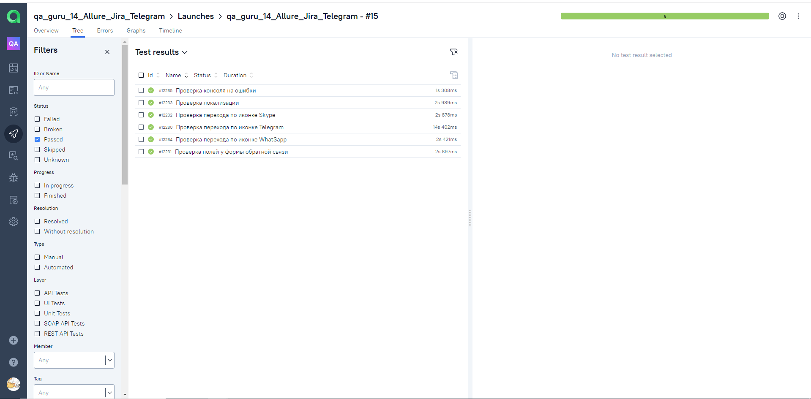
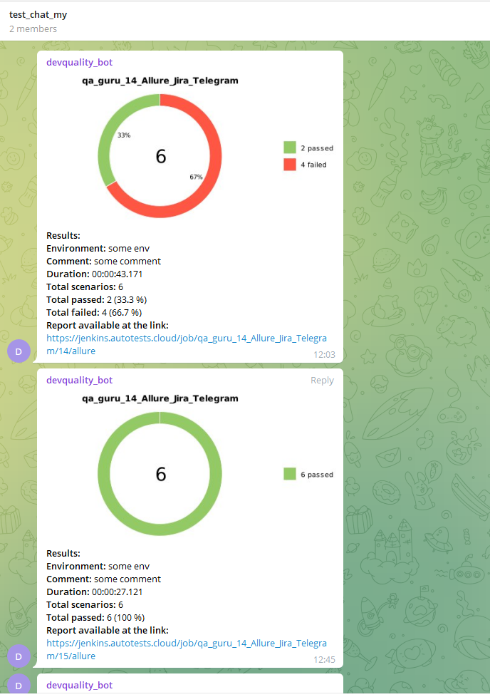

# Проект по автоматизации devquality.ru

## 🚀: Содержание:

- [Технологии и инструменты](#earth_africa-технологии-и-инструменты)
- [Реализованные проверки](#earth_africa-Реализованные-проверки)
- [Сборка в Jenkins](#earth_africa-Jenkins-job)
- [Запуск из терминала](#earth_africa-Запуск-тестов-из-терминала)
- [Примеры использования](#earth_africa-Allure-отчет)
- [Allure отчет](#earth_africa-Allure-отчет)
- [Отчет в Telegram](#earth_africa-Уведомление-в-Telegram-при-помощи-бота)
- [Видео примеры прохождения тестов](#earth_africa-Примеры-видео-о-прохождении-тестов)


## 🧰: Технологии и инструменты

<p align="center">
<a href="https://www.jetbrains.com/idea/"></a>
<a href="https://www.java.com/"></a>
<a href="https://github.com/"></a>
<a href="https://junit.org/junit5/"></a>
<a href="https://gradle.org/"></a>
<a href="https://selenide.org/"></a>
<a href="https://aerokube.com/selenoid/"></a>
<a href="https://github.com/allure-framework/allure2"></a>
<a href="https://www.jenkins.io/"></a>
</p>

## ⚓: Реализованные проверки

Проверка локализации
Проверка полей у формы обратной связи
Проверка перехода по иконке Telegram
Проверка перехода по иконке WhatSapp
Проверка перехода по иконке Skype
Проверка консоля на ошибки

## </a> Jenkins <a target="_blank" href="https://jenkins.autotests.cloud/job/IBS_test/"> job </a>
<p align="center">
<a href="https://jenkins.autotests.cloud/job/qa_guru_14_Allure_Jira_Telegram//"></a>
</p>

## 🧙: Параметры сборки в Jenkins:

- BROWSER (браузер, по умолчанию chrome)
- VERSION (версия браузера, по умолчанию 100.0)
- BROWSERSIZE (размер окна браузера, по умолчанию 1920x1080)

## 🏗️: Запуск тестов из терминала
Локальный запуск:
```
gradle clean test
```

Удаленный запуск:
```
clean
test
-Dbrowser=${BROWSER}
-DbrowserSize=${BROWSERSIZE}
-Dversion=${VERSION}
```

# ⛅: Основной отчет
<p align="center">

</p>


## 🧪: Тесты
<p align="center">

</p>

## </a> Уведомление в Telegram при помощи бота

<p align="center">

</p>

## </a> Видео <a target="_blank" href="https://selenoid.autotests.cloud/video/56a9a3a9a745926ecd5414e8efcf447e.mp4"> прохождения тестов </a>
<p align="center">
<a href="https://selenoid.autotests.cloud/video/56a9a3a9a745926ecd5414e8efcf447e.mp4"></a>
</p>
